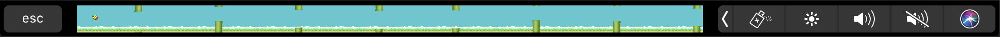
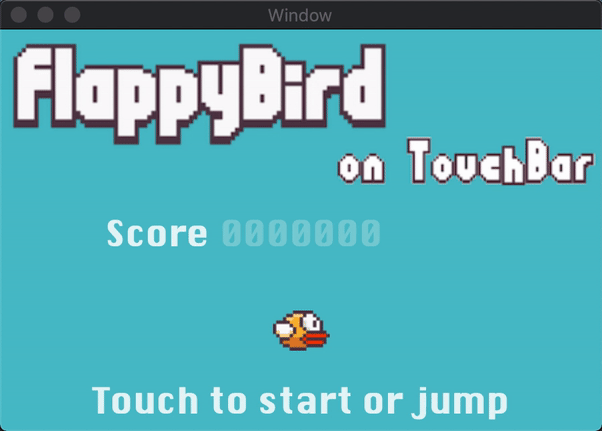

# touchbar-flappy-bird

This is a version of flappy bird that is played on the Macbook touch bar, built with *Swift* and *SpriteKit*.

The game scene is on **touch bar**, shown below:

And the window on screen looks as below:

- This game was made in the Hack\&Roll 2019, click [here](https://devpost.com/software/games-on-touch-bar) to know more.
- [Download](https://drive.google.com/file/d/1ovVo0N3pt4YpMoO-pk5VHvIaesqerIUC/view?usp=sharing) this game
- Collaborator: [CodeXana0001](https://github.com/CodeXana0001)